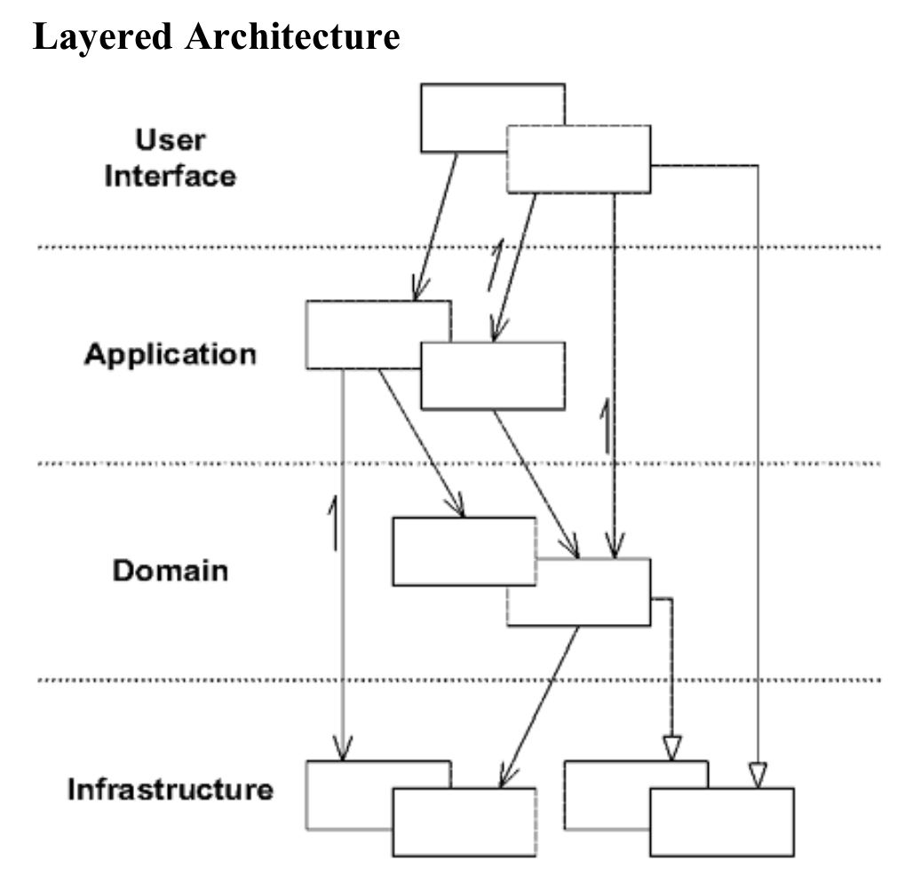

# Domain Driven Design with NestJs

The objective of this repo is to implement a Domain Driven Design. For this propose I choose NestJs framework.

The app consists in a rest API and the idea is to provide endpoints to create and manage travels and passengers.
A travel consists in a route from point A to point B executed by a particular vehicle with a particular driver.
The API provide endpoints to manage travels, routes, drivers and passengers.
 

## Installation

### Clone 

```bash
git clone {{repo_url}}
```

### Create infrastructure
```bash
docker-compose up
```
## Usage

Check the API documentation (Swagger) in [http://localhost:3000/api/docs](http://localhost:3000/api/docs)

## Authentication

The authentication it was made in a separate service. This auth service expose an login endpoint which provides a JWT token with the user information.

Then, the app receives the token through a header, validate the token and set the user information in the request object.

## Architecture
The app is based in a layered architecture with a clearly inter dependency. 

The layers: domain, application, infrastructure, interface.

One of the most important ideas is to keep the domain layer completely decoupled in order to get the business logic isolated and simplest as possible.



#### Domain Layer

Responsible for representing concepts of the business, information about the business situation, and business rules.
State that reflects the business situation is controlled and used here, even though the technical details of storing it are delegated to the infrastructure. This layer is the heart of business software.

#### Application Layer
Defines the jobs the software is supposed to do and directs the expressive domain objects to work out problems.
The tasks this layer is responsible for are meaningful to the business or necessary for interaction with the application layers of other systems.

This layer is kept thin. It does not contain business rules or knowledge, but only coordinates tasks and delegates
work to collaborations of domain objects in the next layer down. It does not have state reflecting the business
situation, but it can have state that reflects the progress of a task for the user or the program.

This layer uses

#### Infrastructure Layer
Provides generic technical capabilities that support the higher layers: message sending for the application, persistence for the domain, drawing widgets for the UI, and so on. The infrastructure layer may also support the
pattern of interactions between the four layers through an architectural framework.

#### Interface Layer
Responsible for showing information to the user and interpreting the user's commands. The external actor might
sometimes be another computer system rather than a human user.

## Bibliography
Eric Evans - Domain-Driven Design: Tackling Complexity in the Heart of Software


## License

[MIT](https://choosealicense.com/licenses/mit/)